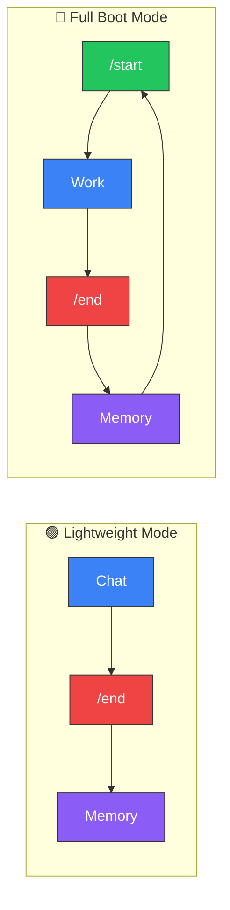

<div align="center">

# Project Athena

**Your memory. Your machine. Any model.**

Open-source cognitive augmentation layer that gives you persistent memory, structured reasoning, and full data ownership — across ChatGPT, Claude, Gemini, and any model you switch to next.

Platforms forget. Athena doesn't.

[](https://github.com/winstonkoh87/Athena-Public/stargazers)
[](LICENSE)
[](docs/CHANGELOG.md)
[](https://www.reddit.com/r/ChatGPT/comments/1r1b3gl/)
[](https://codespaces.new/winstonkoh87/Athena-Public)

[Quickstart](#-quickstart) · [How It Works](#-how-it-works) · [Docs](docs/GETTING_STARTED.md) · [FAQ](docs/FAQ.md) · [Contributing](CONTRIBUTING.md)

*Last updated: 09 March 2026*

</div>

---

## The Problem

You've spent months training ChatGPT to understand you. Then a model update resets the personality. Your custom instructions stop working. You can't find that conversation from last Tuesday. And if you switch to Claude or Gemini? **You start from zero.**

Platform memory is **unreliable, opaque, and locked to one provider**. You don't own it, you can't inspect it, and you can't take it with you.

## Why Athena?

Athena moves the memory layer to **your machine**. Plain Markdown files that you own, version-control, and point at any model.

- **🧠 Your Memory, Your Machine** — Files on your disk, not in OpenAI's cloud. Read them, edit them, git-version them.
- **🔌 Switch Models Freely** — Claude today, Gemini tomorrow, GPT next week. The memory stays. The model is just whoever's on shift.
- **📈 It Compounds** — Session 500 recalls patterns from session 5. Platform memory decays; Athena's doesn't.
- **⚡ ~10K Token Boot** — 95% of your context window stays free, even after 10,000 sessions.
- **🛡️ Governed Autonomy** — 6 constitutional laws, 4 capability levels, bounded agency.

> *A generic LLM is a brilliant amnesiac. Athena is the hippocampus — the memory that makes intelligence useful.*
>
> *Or in engineering terms: The LLM is the engine. Athena is the chassis, the memory, and the rules of the road. Swap the engine anytime — the car remembers every road you've driven.*
>
> *The design philosophy: [augment the human, not replace them](docs/concepts/Grace_Protocol.md).*

### The Human Augmentation Thesis

Athena's centralised design principle: **augment human cognition, not replace it.** The more context you give Athena, the sharper its answers become — not by remembering your preferences, but by **reasoning differently because of what it knows about you.**

A generic LLM gives generic textbook answers. Athena gives answers that are calibrated to *your specific situation*:

<table>
<tr>
<th width="25%">Question</th>
<th width="37%">Generic LLM</th>
<th width="38%">Athena (with your context)</th>
</tr>
<tr>
<td><strong>The Trolley Problem</strong></td>
<td>
“Pull the lever — utilitarian calculus says save five lives.”
</td>
<td>
Challenges the false binary. Generates third options. Asks why you’re on the tracks in the first place. Identifies the systemic failures that created the dilemma. Refuses to solve the wrong problem.
</td>
</tr>
<tr>
<td><strong>“Should I double down on 11 vs dealer’s 6?”</strong></td>
<td>
“Yes — the math says doubling is the optimal play.”
</td>
<td>
“The math is correct, but <strong>you</strong> are betting $4K of your $4K take-home salary. Your utility function makes this −EEV. Law #1: No Irreversible Ruin. <strong>Do not bet.</strong>” — <a href="examples/protocols/decision/330-economic-expected-value.md">Protocol 330</a>
</td>
</tr>
<tr>
<td><strong>“Should I take this job offer?”</strong></td>
<td>
“Consider salary, growth potential, work-life balance...”
</td>
<td>
Cross-references your risk profile, career decision history, financial runway, and the regret patterns from your last 3 career transitions to give a recommendation specific to <em>your</em> situation.
</td>
</tr>
</table>

> **The gap between intelligence and wisdom is context.** A generic LLM has intelligence — it can reason and calculate. But it operates in a vacuum. Athena closes that gap by maintaining a persistent, evolving model of *who you are* — your values, your constraints, your history of decisions and their outcomes. The same faculty that separates a mentor from a textbook.

---

## "…But doesn't ChatGPT / Gemini / Claude already do this?"

Kind of. But there's a difference between *remembering your name* and *thinking in your frameworks*:

| Capability | Platform Memory (ChatGPT, Gemini, Claude) | Athena |
|:-----------|:------------------------------------------|:-------|
| **Who owns the data?** | The platform | **You** |
| **Can you inspect it?** | No — it's a black box | Yes — it's markdown files you can read and edit |
| **Can you search it?** | Vague recall, no precision | Full semantic + keyword search with file links |
| **Cross-platform?** | Locked to one provider | Same memory works across Claude, Gemini, GPT, Grok |
| **Version history?** | None — no rollback, no audit trail | Full `git log`, `git diff`, `git blame` |
| **What if you switch providers?** | Start over | Nothing changes — your data stays |

> **💡** Think of platform memory like photos on Instagram — you can view them, but you don't own them, can't move them, and can't search them precisely. Athena is keeping the originals on your hard drive, with albums, metadata, and full edit history.

### "How is Athena different from...?"

| Tool | What It Does | How Athena Is Different |
|:-----|:-------------|:------------------------|
| **Manus / Managed AI Agents** | Cloud-hosted AI agents with persistent memory, custom skills, and messenger integration. You pay $39–$199/mo for access. | **You don't own the data.** Manus holds your context, memory, and workflows on their servers. Leave the platform = lose everything. Athena stores everything on *your* machine — readable, forkable, portable. Same capabilities, opposite ownership model. Athena is the house; Manus is the hotel. |
| **Lindy / AI Operators** | Autonomous AI assistants that run 24/7 in the cloud — scheduling, research, outreach. | Always-on cloud is convenient, but you rent the brain. Athena runs locally through your IDE — no monthly fee, no platform risk, no lock-in. Trade convenience for sovereignty. |
| **ChatGPT Projects** | Uploads files per-project, but resets every new chat. Locked to OpenAI. | Athena persists across *all* chats, *all* models, with full version history. |
| **OpenClaw** | Prompt distribution — share and discover prompts. | Athena is **personalisation** — your compounding memory system, not a prompt marketplace. Different layer, different problem. |
| **Claude Code** | Great for Claude coding workflows. | Athena works across *any* model and *any* IDE. Not coding-specific — used for research, strategy, writing, life management. |
| **Gemini Gems** | Custom chatbots inside Gemini. | Gems are locked to Gemini and lose context between chats. Athena is portable and persistent. |
| **Custom Instructions** | 1,500-character personality prompt. | Athena loads ~10K tokens of structured protocols, decision frameworks, and session history — re-injected every session from your disk. |

---

<details>
<summary><strong>🧬 Why Thousands of Files?</strong></summary>

Athena's workspace looks unusual — **350+ Markdown files** and **600+ Python scripts** out of the box, growing to thousands as your memory compounds. **This is deliberate.**

AI agents don't read files top-to-bottom like humans. They **query** — by filename, semantic search, or tag lookup. Each small file is an **addressable memory node** the agent can retrieve surgically, without loading everything else.

| Principle | What It Means |
|:----------|:-------------|
| **JIT Loading** | Boot at ~10K tokens. Load specific files only when the query demands them. A monolith forces the full context into every session. |
| **Zero Coupling** | A marketing protocol loads without touching the trading stack. Change one file, break nothing else. |
| **Surgical Retrieval** | The agent pulls `CS-378-prompt-arbitrage.md` by name — not page 47 of a 200-page doc. The file system *is* the index. |
| **Git-Friendly** | Atomic diffs per file. Clean commit history. No merge conflicts from a single giant file. |
| **Composable Agents** | Swarms, workflows, and skills are mix-and-match. Each file is a Lego brick, not a chapter in a novel. |

> *A monolith is optimized for a human reading a book. A modular workspace is optimized for an agent querying a database. Athena chose the agent.*

</details>

---

## ⚡ Quickstart

**Works on macOS, Windows, and Linux.**

### 1. Clone the repo

```bash
git clone https://github.com/winstonkoh87/Athena-Public.git
cd Athena-Public
```

Clone it anywhere you keep projects (e.g. `~/Projects/`). This folder **is** your Athena workspace — your memory, protocols, and config all live here.

### 2. Set up a virtual environment *(recommended)*

```bash
# Create and activate a virtual environment
python3 -m venv .venv
source .venv/bin/activate   # macOS / Linux
# .venv\Scripts\activate    # Windows
```

> [!IMPORTANT]
> On macOS (Homebrew) and Ubuntu 23.04+, installing packages without a virtual environment will fail with `externally-managed-environment`. The step above prevents this.

### 3. Install the SDK *(optional — enables CLI commands)*

```bash
# Lightweight install (~30 seconds, no ML dependencies)
pip install -e .

# Full install (~5–10 min, enables vector search and reranking)
pip install -e ".[full]"
```

> ⚠️ **Don't `pip install athena-cli`** — that's a different, unrelated package. Always install from inside the cloned repo.

### 4. Open the folder in an AI-enabled IDE

Open the `Athena-Public/` directory as your **workspace root** in one of these editors:

- [Antigravity](https://antigravity.google/) · [Cursor](https://cursor.com) · [Claude Code](https://docs.anthropic.com/en/docs/claude-code) · [VS Code + Copilot](https://code.visualstudio.com/) · [Kilo Code](https://kilocode.ai/) · [Gemini CLI](https://github.com/google-gemini/gemini-cli)

> [!IMPORTANT]
> **Athena does NOT work through ChatGPT.com, Claude.ai, or Gemini web.** You need an app that can **read files from your disk**. Think of Athena as a workspace for your editor, not a plugin for a chatbot.

> [!NOTE]
> **"Why do I open the Athena folder instead of my own project?"** — Athena is a *workspace*, not a library you install into another repo. You work *inside* the Athena folder, and it remembers everything across sessions. To work on external projects, reference them from within Athena or use multi-root workspaces in your IDE.

### 5. Boot (in the AI chat panel — not the terminal)

In your IDE's **AI chat panel** (e.g. Cmd+L in Cursor, the chat sidebar in Antigravity), type:

```
/start
```

> [!CAUTION]
> `/start`, `/end`, and `/tutorial` are **AI chat commands** — you type them in the chat window where you talk to the AI, **not** in the terminal. They are slash commands that the AI agent reads and executes.

### 6. First time? Take the guided tour

```
/tutorial
```

This walks you through everything: what Athena is, how it works, builds your profile, and demos the tools (~20 min). Confident users can skip it.

### 7. When you're done

```
/end
```

**That's it.** No API keys. No database setup. The folder *is* the product.

> [!CAUTION]
> **Forks of public repos are public by default.** If you plan to store personal data (health records, finances, journals), **create a new private repo** instead of forking. Copy the files manually or use `git clone` + `git remote set-url` to point to your private repo. [GitHub docs on fork visibility →](https://docs.github.com/en/pull-requests/collaborating-with-pull-requests/working-with-forks/about-permissions-and-visibility-of-forks)

> [!TIP]
> See the [full setup guide →](docs/YOUR_FIRST_SESSION.md) for detailed walkthroughs and troubleshooting.

<details>
<summary><strong>🪟 Windows Compatibility (Unicode Errors)</strong></summary>

Athena uses modern terminal outputs (Emojis, Box-Drawing characters) which may cause a `UnicodeEncodeError` on legacy Windows terminals (like `cmd.exe` or older PowerShell versions using `cp1252` encoding).

To resolve this natively without altering the codebase:

1. Use **Windows Terminal** (available in the Microsoft Store).
2. Set your Python IO encoding to UTF-8 by running:
   `$env:PYTHONIOENCODING="utf-8"` (PowerShell) or `set PYTHONIOENCODING=utf-8` (Command Prompt).
3. Alternatively, enable strict UTF-8 globally in Windows: *Settings > Time & Language > Language & Region > Administrative language settings > Change system locale > Check "Beta: Use Unicode UTF-8 for worldwide language support"*.

</details>

---

## 🔄 How It Works

Every session follows one cycle. **Two modes** let you match overhead to task complexity:



| Mode | When | Flow |
|:-----|:-----|:-----|
| **🟢 Lightweight** | General chat, brain dumps, quick Q&A | Just chat → `/end` |
| **🔴 Full Boot** | Code, money, architecture, irreversible decisions | `/start` → Work → `/end` |

| Sessions | What Happens |
|:---------|:------------|
| **1–50** | Basic recall — remembers your name, project, preferences |
| **50–200** | Pattern recognition — anticipates your style and blind spots |
| **200+** | Deep sync — thinks in your frameworks before you state them |

### The Biological Analogy

Athena is modelled after the human body. Built bottom-up by the creator. Used top-down by the user.

| Biology | Athena | What It Does |
|:--------|:-------|:-------------|
| Atom | Rule / Axiom | Smallest indivisible truth (`Law #1: No Irreversible Ruin`) |
| Molecule | Protocol (`.md`) | Rules composed into a reusable procedure |
| Cell | Skill | Self-contained executable unit |
| Organ | Cognitive Cluster | Multi-skill unit for one cognitive domain |
| Organ System | Cognitive System | Multi-cluster orchestration for a human need archetype |
| Organism | Athena | The complete synthetic intelligence |

> *"As within, so without, as above, so below." — Same pattern at every layer. Fractal by design.*

### The Linux Analogy

| Concept | Linux | Athena |
|:--------|:------|:-------|
| Kernel | Hardware abstraction | Memory persistence + retrieval (RAG, Supabase) |
| File System | ext4, NTFS | Markdown files, session logs, tag index |
| Scheduler | cron, systemd | Heartbeat daemon, auto-indexing |
| Shell | bash, zsh | MCP Tool Server, `/start`, `/end`, `/think` |
| Permissions | chmod, users/groups | 4-level capability tokens + Secret Mode |
| Package Manager | apt, yum | Protocols, skills, workflows |

---

## 📦 What's In The Box

Everything you need to turn a generic AI into **your** AI — pre-configured, no assembly required.

| Component | What It Does For You |
|:----------|:---------------------|
| 📄 **Agent Manifest** | Single `athena.yaml` file defines your agent — model, tools, skills, hooks, governance. Fork it, override it, boot a new agent — [manifest](athena.yaml) |
| 🧠 **Core Identity** | Your AI's personality, principles, and boundaries — editable, version-controlled — [template](examples/templates/core_identity_template.md) |
| 🧩 **8 Cognitive Systems** | Top-down intent classification — routes queries to the right cluster sequence based on *human need archetype* (Survival, Life Decision, Trading, Social, Execution, Growth, Learning, Maintenance) — [architecture](examples/protocols/architecture/507-cognitive-systems.md) |
| 🔗 **Cognitive Clusters** | Groups related protocols into auto-co-activating bundles — 15 clusters included, build your own as you grow — [template](examples/templates/cluster_index_template.md) |
| 📋 **138 Protocols** | Ready-made decision frameworks (risk analysis, research, strategy, problem-solving) across 15 categories — [browse](examples/protocols/) |
| ⚡ **50+ Slash Commands** | One-word triggers: `/start`, `/end`, `/think`, `/research` — [full list](docs/WORKFLOWS.md) |
| 🔍 **Smart Search** | Finds the right memory even if you describe it vaguely (5 sources, auto-ranked) — [how it works](docs/SEMANTIC_SEARCH.md) |
| 🔌 **Tool Integration** | Declarative YAML tool definitions + MCP server — your agent discovers and invokes tools automatically — [tools](tools/) · [MCP docs](docs/MCP_SERVER.md) |
| 🪝 **Lifecycle Hooks** | Scriptable pre/post gates on every action — block destructive ops, enforce risk checks, log assets — [hooks](docs/HOOKS.md) |
| 🛡️ **Safety Rails** | Controls what the AI can and can't do autonomously (4 levels, from read-only to full agency) — [security](docs/SECURITY.md) |

> [!TIP]
> Run `/tutorial` on your first session for a guided walkthrough (~20 min). It explains everything above and builds your personal profile.

### Agent Compatibility

Athena works through **AI-enabled code editors** — apps that connect to AI models while reading your local files. It does **not** work through ChatGPT.com, Claude.ai, or Gemini web — those are closed sandboxes that can't read your disk.

| Agent | Status | Init Command |
|:------|:------:|:-------------|
| [Claude Code](https://docs.anthropic.com/en/docs/claude-code) | ✅ | `athena init --ide claude` |
| [Antigravity](https://antigravity.google/) | ✅ | `athena init --ide antigravity` |
| [Cursor](https://cursor.com) | ✅ | `athena init --ide cursor` |
| [Gemini CLI](https://github.com/google-gemini/gemini-cli) | ✅ | `athena init --ide gemini` |
| [VS Code + Copilot](https://code.visualstudio.com/) | ✅ | `athena init --ide vscode` |
| [Kilo Code](https://kilocode.ai/) | ✅ | `athena init --ide kilocode` |
| [Roo Code](https://roocode.com/) | ✅ | `athena init --ide roocode` |

> More agents planned — [full compatibility list →](docs/COMPATIBLE_IDES.md)
>
> **"How is this different from ChatGPT Projects?"** — Projects reset every new chat and are locked to one platform. Athena persists across *all* chats, *all* models, with full version history. [Details →](docs/FAQ.md)

---

## 🎯 Use Cases

| | Use Case | What It Looks Like |
|:-|:---------|:-------------------|
| 🏠 | **Life Management** | The superset. Health, career, relationships, finances, client work — all managed as projects in one unified switchboard. By day 3, Athena remembers your schedule. By month 3, it anticipates your patterns. Athena doesn't have a separate project manager and life tracker — it has one board where your gym routine and your client deadline are rows governed by the same triage rules. That's how it can tell you *"skip the client call — your sleep debt is a higher-urgency blocker than the $250 deliverable."* No other system crosses the work/life boundary. — [case study →](docs/CASE_STUDIES.md#case-study-1-from-routine-app-to-life-engine-in-72-hours) |
| 🧠 | **Problem Solving** | *"I can't afford $200/hr therapy but I need to understand why I keep self-sabotaging."* — Athena runs a structured schema interview, maps your internal protective parts (IFS methodology), and connects the pattern to your documented history. Session 40 recalls the wound identified in session 3. A therapist charges $200+/hr and sees you once a week. Athena is available 24/7 for the cost of your AI subscription. — [case study →](docs/CASE_STUDIES.md#case-study-2-the-200hr-therapist-alternative) |
| 🎯 | **Decision Making** | *"Should I take this job? Sign this contract? Confront this person?"* — Athena cross-references your risk profile, financial runway, career decision history, and the regret patterns from your last 3 similar decisions to produce a recommendation no generic LLM could give. A business coach charges $500+/hr. Athena does it in under an hour. — [case study →](docs/CASE_STUDIES.md#case-study-3-the-multi-stakeholder-career-decision) |
| 💼 | **Work & Projects** | A subset of Life Management. Juggle 5+ projects without dropping context. `/project` gives you a visual switchboard — phase-gated progress, urgency/EV ranking, and instant context-switching. Internal projects (health, career) and external projects (clients, revenue) tracked separately with cross-project dependency awareness. — [workflow →](examples/workflows/project.md) |
| ✍️ | **Writing & Voice** | After 30 sessions, the AI stops sounding like ChatGPT and starts sounding like *you*. Learns your style from your own writing samples. |
| 🔬 | **Research & Synthesis** | Compile 200 sources into one framework — still searchable and citable 6 months later. |
| 📐 | **Strategic Planning** | Long-term planning across dozens of sessions. Budget modeling, scenario analysis, with full context of your past decisions. |

> **The asymmetry.** A licensed therapist costs $200+/hr. A business coach costs $500+/hr. A negotiation consultant costs $1,000+/hr. Athena gives you structured, context-aware guidance across *all* of these domains — 24/7, for the cost of your existing AI subscription. It doesn't replace professionals for clinical emergencies, but for the 90% of life decisions and psychological patterns that don't require a medical license, it closes the gap between *having access to wisdom* and *not being able to afford it*.

> **Not just for coding.** Athena is used for personal knowledge management, health tracking, creative writing, business strategy, and daily life — by people who've never written a line of code.

---

## 💰 Cost

**Athena is free. Forever. MIT licensed.** You only pay for the AI subscription you're probably already paying for.

| Plan | Cost | Who It's For |
|:-----|:-----|:-------------|
| **Google Antigravity (free tier)** | **$0** | **Try Athena first** — included with any Google account |
| Claude Pro / Google AI Pro | ~$20/mo | Daily users — the sweet spot for most people |
| Claude Max / Google AI Ultra | $200+/mo | Power users managing multiple domains (8+ hrs/day) |

> **Try before you buy.** Athena works with Google Antigravity's free tier — clone the repo, type `/start`, and see if it clicks. No credit card, no trial period, no catch. Upgrade only when you hit the free tier's daily limits.

> **Why $200/mo is worth it for power users.** Heavy Athena users routinely consume the equivalent of $2K–$3K in API costs per month. The subscription cap turns variable cost into fixed cost — the more you use it, the better the deal. Use Gemini models for standard work and reserve frontier models (e.g. Claude Opus) for high-stakes decisions where reasoning depth matters most.

> Boot cost is ~10K tokens — constant whether it's session 1 or session 10,000. [Details →](docs/BENCHMARKS.md)

> [!NOTE]
> Athena works with any model, but governance protocols and multi-step reasoning perform best with frontier models (e.g. Claude Opus 4.6, Gemini 3.1 Pro, GPT-5.4). Start with the free tier to test compatibility with your preferred model.

> [!TIP]
> **Save money getting started** *(as of 09 Mar 2026)*. Google offers a [1-month free trial on AI Pro](https://one.google.com/ai) for new subscribers — enough to fully evaluate Athena with frontier-tier Antigravity limits at $0. Alternatively, if someone you know is on a Google AI Pro or Ultra plan, they can add you as a family member — each member gets their own independent Antigravity quota at no extra cost.

---

## 📚 Documentation

| | | |
|:--|:--|:--|
| 📖 [Getting Started](docs/GETTING_STARTED.md) | 🏗️ [Architecture](docs/ARCHITECTURE.md) | 🔒 [Security](docs/SECURITY.md) |
| 🎯 [Your First Session](docs/YOUR_FIRST_SESSION.md) | 🔍 [Semantic Search](docs/SEMANTIC_SEARCH.md) | 📊 [Benchmarks](docs/BENCHMARKS.md) |
| 💡 [Tips](docs/TIPS.md) | 🔌 [MCP Server](docs/MCP_SERVER.md) | ❓ [FAQ](docs/FAQ.md) |
| 🔄 [Updating Athena](docs/UPDATING.md) | 📥 [Importing Data](docs/IMPORTING.md) | ⌨️ [CLI Reference](docs/CLI.md) |
| 📋 [All Workflows](docs/WORKFLOWS.md) | 📐 [Spec Sheet](docs/SPEC_SHEET.md) | 📓 [Glossary](docs/GLOSSARY.md) |
| 🧠 [Manifesto](docs/MANIFESTO.md) | 📈 [Changelog](docs/CHANGELOG.md) | 🔀 [Multi-Model Strategy](docs/MULTI_MODEL_STRATEGY.md) |
| ✅ [Best Practices](docs/BEST_PRACTICES.md) | 🤖 [Your First Agent](docs/YOUR_FIRST_AGENT.md) | 🧩 [What Is an AI Agent?](docs/WHAT_IS_AN_AI_AGENT.md) |

---

## 🛠️ Tech Stack

| Layer | Technology |
|:------|:----------|
| **IDE** | Antigravity |
| **Reasoning Engine** | Gemini 3.1 Pro (High) / Claude Opus 4.6 (Thinking) / GPT-5.4 |
| **SDK** | `athena` Python package (v9.4.6) |
| **Search** | Hybrid RAG — FlashRank reranking + RRF fusion |
| **Embeddings** | `text-embedding-004` (768-dim) |
| **Memory** | Supabase + pgvector / local ChromaDB |
| **Routing** | Risk-Proportional Triple-Lock — SNIPER / STANDARD / ULTRA |

<details>
<summary><strong>📂 Repository Structure</strong></summary>

```text
Athena-Public/
├── athena.yaml              # Agent manifest — model, tools, hooks, governance
├── src/athena/              # SDK package (pip install -e .)
│   ├── core/                #   Config, governance, permissions, security
│   ├── tools/               #   Search, agentic search, reranker, heartbeat
│   ├── memory/              #   Vector DB, delta sync, schema
│   ├── boot/                #   Orchestrator, loaders, shutdown
│   ├── cli/                 #   init, save, doctor commands
│   └── mcp_server.py        #   MCP Tool Server (9 tools, 2 resources)
├── tools/                   # Declarative tool definitions (YAML)
├── scripts/                 # Operational scripts (boot, shutdown, launch)
├── examples/
│   ├── protocols/           # 138 starter frameworks (15 categories)
│   ├── scripts/             # 540+ reference scripts
│   └── templates/           # Starter templates (framework, memory bank)
├── docs/                    # Architecture, benchmarks, security, guides
└── pyproject.toml           # Modern packaging
```

</details>

<details>
<summary><strong>📋 Recent Changelog</strong></summary>

- **v9.4.6** (Mar 09 2026): Project Switchboard — `/project` workflow (view, add, switch, close, triage), PROJECTS.md template, Internal/External zones, cross-project dependencies, `/start` + `/end` integration
- **v9.4.5** (Mar 09 2026): Two-Mode Session Architecture — Lightweight (skip `/start`) vs Full Boot. Framework Tax concept. Orchestrator-Executor Pipeline. Crisis Architecture (P509, P519, P520, P521)
- **v9.4.4** (Mar 07 2026): GTO Routing Diagram — expanded from 2/8 → 8/8 system cluster chains, priority tier color-coding (Critical/High/Standard/Support), reordered Q4-Q6 to match priority waterfall
- **v9.4.3** (Mar 07 2026): Maintenance — AGENTS.md version sync, file count corrections (138 protocols, 540+ scripts), date alignment
- **v9.4.2** (Mar 05 2026): Cognitive Architecture v2.1 — Homeostatic Pressure (P517), Reflexion Journaling (P515), Memory Paging (P516), LIDA Broadcast routing, deterministic exit verification, Ebbinghaus decay, context clearing
- **v9.4.1** (Mar 04 2026): Cognitive Systems v2 — Ideation mode (DIVERGENT/CONVERGENT), Learning→Life Decision handoff, Cluster #14 safety sequence, P503 cluster sync (15), Λ-based stealth routing, 3 new protocols (P511 Business Viability, P512 Pre-Planning, P513 Context Isolation)
- **v9.4.0** (Mar 04 2026): Biological Stack Architecture — 5 new protocols (P504-P508), 8 Cognitive Systems layer, Intent Classifier, `ensure_env.sh` supports system Python
- **v9.3.1** (Mar 03 2026): Cross-model Audit Fixes — file count sync, Windows section relocation, GitHub Release catch-up (v9.2.7–v9.3.0)
- **v9.3.0** (Mar 02 2026): Onboarding Friction Audit — dependency restructuring (torch→optional), venv instructions, PEP 668 fix, stale path cleanup, two-tier install
- **v9.2.9** (Mar 02 2026): Ultrathink v4.1 HITL Bypass — manual Gemini sandbox option, micro-pruned 10% dead skills (100% cluster coverage), broken reference audit
- **v9.2.8** (Feb 27 2026): Skill Template Expansion — 5 starter skill templates across 4 categories for new AG users
- **v9.2.7** (Feb 26 2026): Risk-proportional Triple-Lock, Tier 0 context summaries, 3 new academic citations
- **v9.2.6** (Feb 25 2026): Kilo Code + Roo Code IDE integration, `COMPATIBLE_IDES.md`, issue #19 closed
- **v9.2.5** (Feb 24 2026): Life Integration Protocol Stack — Protocols 381-383, Emotional Audit, `/review` workflow
- **v9.2.3** (Feb 21 2026): Multi-agent safety hardening, CLAUDE.md symlinks, issue deflection
- **v9.2.2** (Feb 21 2026): S-tier README refactor, docs restructure
- **v9.2.1** (Feb 20 2026): Deep Audit & PnC Sanitization — 17 patterns sanitized across 13 files
- **v9.2.0** (Feb 17 2026): Sovereignty Convergence — CVE patch, agentic search, governance upgrade
- **v9.1.0** (Feb 17 2026): Deep Audit & Sync — Fixed 15 issues (dead links, version drift)
- **v9.0.0** (Feb 16 2026): First-Principles Workspace Refactor — root dir cleaned, build artifacts purged

👉 [Full Changelog →](docs/CHANGELOG.md)

</details>

---

<div align="center">

### 🌟 Star History

[](https://star-history.com/#winstonkoh87/Athena-Public&Date)

**MIT License** · [Contributing](CONTRIBUTING.md) · [Security](SECURITY.md) · [Code of Conduct](CODE_OF_CONDUCT.md)

*Clone it. Boot it. Make it yours.*

</div>
