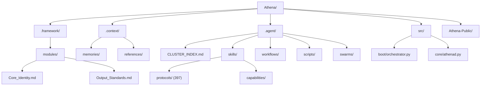
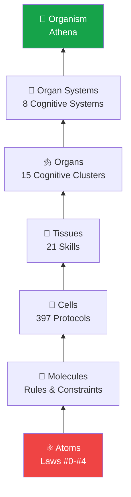
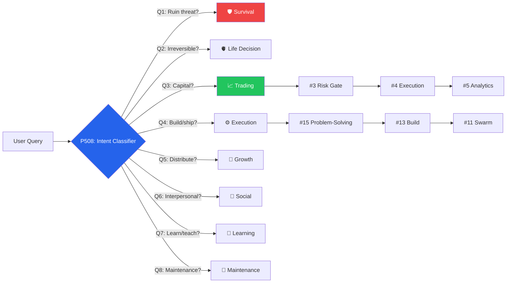
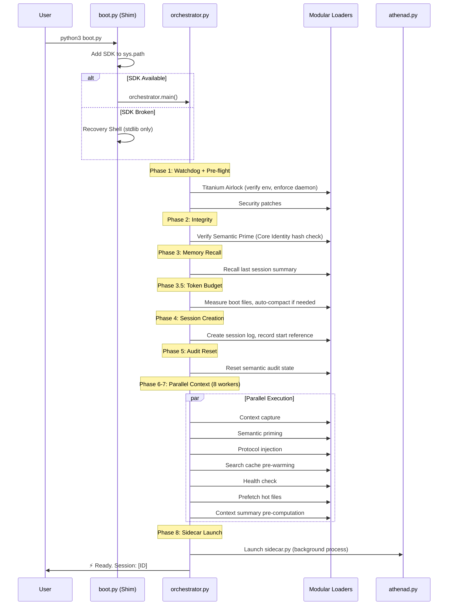
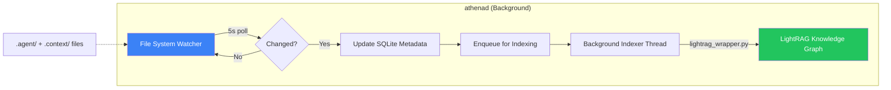
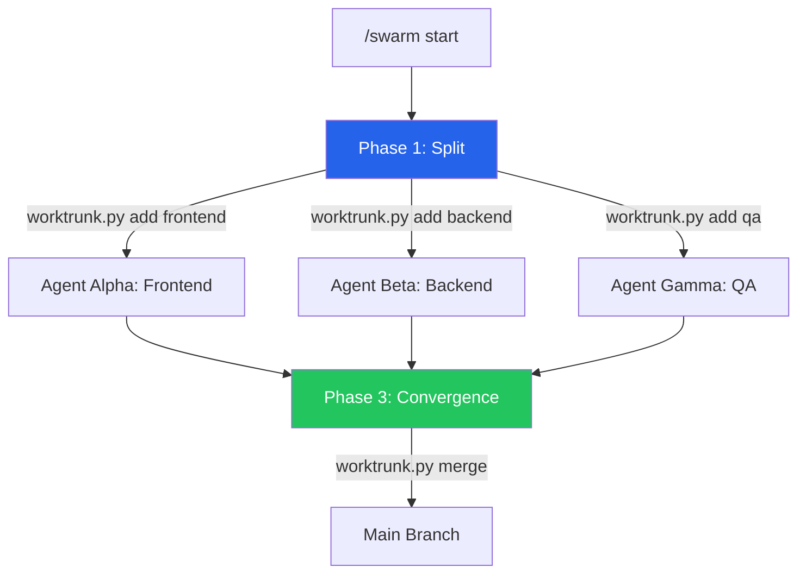
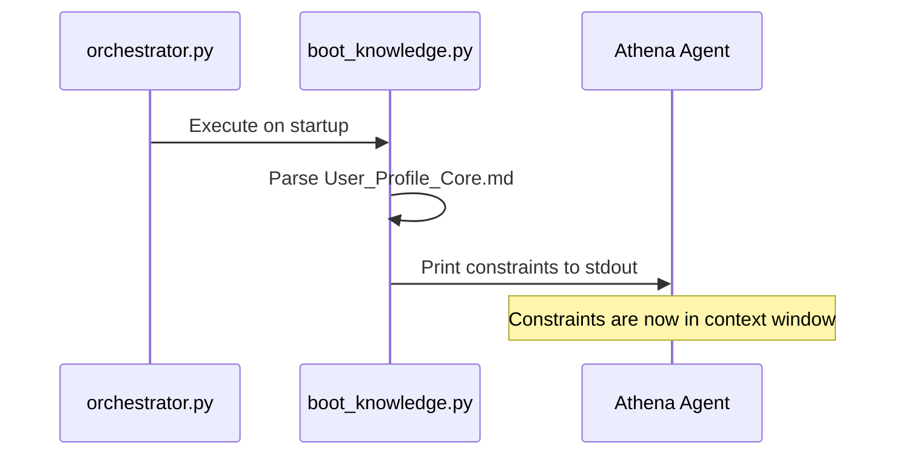
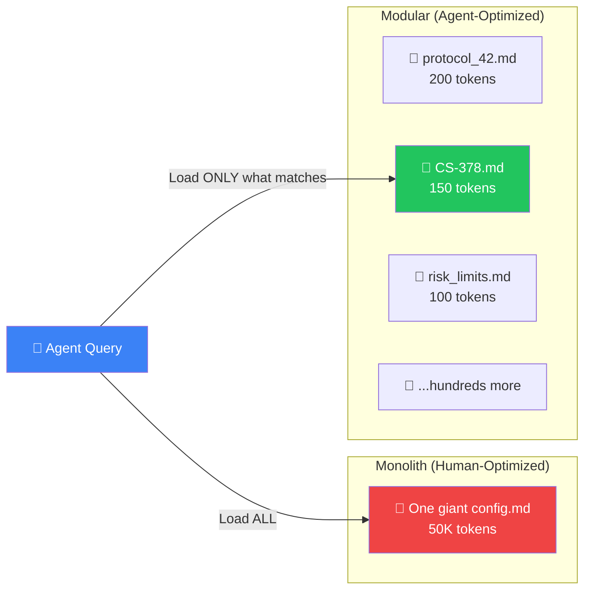
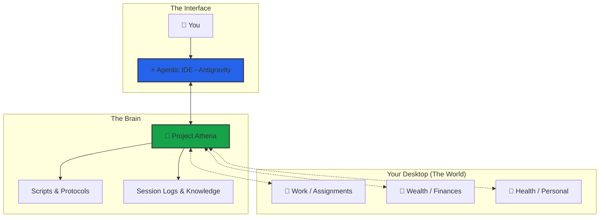

# Athena Workspace Architecture

> **Last Updated**: 04 March 2026  
> **System Version**: v9.4.0

> [!NOTE]
> This document describes the architecture of a **mature Athena workspace** — what your installation grows into over time. The public repository ([Athena-Public](https://github.com/winstonkoh87/Athena-Public)) ships with a starter subset: 115+ example protocols, reference scripts, and templates. As you use Athena, your workspace compounds toward the full architecture described here.

---

## Directory Structure

```text
Athena/
├── .framework/                    # ← THE CODEX (stable, rarely updated)
│   ├── v8.2-stable/               # Current stable modules directory
│   │   ├── modules/
│   │   │   ├── Core_Identity.md   # Laws #0-#4, RSI, Bionic Stack, COS
│   │   │   └── Output_Standards.md # Response formatting, reasoning levels
│   │   ├── protocols/             # Versioned protocol copies
│   │   └── templates/             # Core templates
│   └── archive/                   # Archived monoliths
│
├── .context/                      # ← USER-SPECIFIC DATA (frequently updated)
│   ├── User_Vault/                # Personal vault (credentials, secrets)
│   ├── memories/
│   │   ├── case_studies/          # 410+ documented patterns
│   │   ├── session_logs/          # Historical session analysis
│   │   └── patterns/              # Formalized patterns
│   ├── references/                # External frameworks (Dalio, Halbert, Graham)
│   ├── research/                  # Steal analyses, explorations
│   ├── TAG_INDEX_A-M.md           # Global hashtag system (split for performance)
│   ├── TAG_INDEX_N-Z.md
│   └── KNOWLEDGE_GRAPH.md         # Visual architecture reference
│
├── .agent/                        # ← AGENT CONFIGURATION
│   ├── CLUSTER_INDEX.md           # Routing index: Systems → Clusters → Skills
│   ├── skills/
│   │   ├── SKILL_INDEX.md         # Protocol loading registry
│   │   ├── protocols/             # 397 modular skill files across 35 domains
│   │   │   ├── architecture/      # System protocols (latency, modularity)
│   │   │   ├── business/          # Business frameworks
│   │   │   ├── coding/            # Development standards
│   │   │   ├── decision/          # Decision frameworks (EEV, GTO, MCDA)
│   │   │   ├── engineering/       # Engineering practices
│   │   │   ├── marketing/         # Marketing & distribution
│   │   │   ├── memory/            # Memory compression & retrieval
│   │   │   ├── meta/              # Meta-protocols (Red Team, Zero-Point)
│   │   │   ├── psychology/        # Psych protocols
│   │   │   ├── reasoning/         # Reasoning frameworks
│   │   │   ├── safety/            # Safety & risk protocols
│   │   │   ├── strategy/          # Strategy frameworks
│   │   │   ├── trading/           # Trading protocols
│   │   │   ├── verification/      # Verification & QA
│   │   │   └── ... (+20 more)     # workflow, research, health, etc.
│   │   └── capabilities/          # Bionic Triple Crown
│   ├── workflows/                 # 53 slash commands
│   │   ├── start.md               # Session boot
│   │   ├── end.md                 # Session close + maintenance
│   │   ├── think.md               # Deep reasoning (L4)
│   │   └── ...
│   ├── scripts/                   # 220+ Python automation scripts
│   │   ├── boot.py                # Resilient boot shim + recovery shell
│   │   ├── quicksave.py           # Auto-checkpoint every exchange
│   │   ├── smart_search.py        # Semantic search (hybrid RAG)
│   │   ├── sidecar.py             # Sovereign index process
│   │   └── ...
│   ├── swarms/                    # Multi-agent orchestration
│   │   └── marketing_team/        # 16-agent marketing swarm
│   └── gateway/                   # Sidecar process for persistence
│
├── src/                           # ← PYTHON SDK SOURCE
│   └── athena/
│       ├── boot/                  # Boot pipeline
│       │   ├── orchestrator.py    # 8-phase parallel boot sequence
│       │   ├── loaders/           # Modular loaders (UI, State, Identity, Memory, System)
│       │   └── constants.py       # Colors, paths, mount points
│       ├── core/                  # Core runtime
│       │   ├── athenad.py         # Daemon: file watcher + LightRAG indexer
│       │   ├── health.py          # System health checks
│       │   └── security.py        # Security patches
│       └── tools/                 # SDK tools
│
├── supabase/                      # ← VECTORRAG CONFIG
│   └── migrations/                # Database migrations
│
├── tests/                         # ← TEST SUITE
│
├── Athena-Public/                 # ← PUBLIC PORTFOLIO
│   ├── docs/                      # This documentation
│   ├── examples/                  # 127 public protocol examples, templates, scripts
│   ├── src/                       # Public SDK source
│   ├── community/                 # Community resources
│   └── README.md                  # Repository overview
│
└── docs/                          # Root-level docs (private)
```

### Visual Overview



---

## The Compositional Stack

> **Core Architecture**: Athena is built bottom-up from atomic rules to a fully integrated synthetic intelligence. Two complementary models describe the architecture: the **Compositional Hierarchy** (what the layers are) and the **Neuro-Cognitive Model** (how they govern).

### Compositional Hierarchy



| Layer | Analogy | Athena Equivalent | Example |
|:---:|:---|:---|:---|
| 1 | **Atoms** | Laws #0-#4 | Law #1: No Ruin (absolute, non-negotiable) |
| 2 | **Molecules** | Rules & Constraints | "Never risk >5% of bankroll" |
| 3 | **Cells** | 397 Protocols | Protocol 330: Economic Expected Value |
| 4 | **Tissues** | 21 Skills | `trading-risk-gate` (bundles 3 protocols) |
| 5 | **Organs** | 15 Cognitive Clusters | Cluster #3: Trading Risk Gate |
| 6 | **Organ Systems** | 8 Cognitive Systems | Trading System 📈 |
| 7 | **Organism** | Athena | The complete synthetic intelligence |

**Emergent Properties:**

- Atoms → Molecules: Rules become *procedures* (sequence matters)
- Molecules → Cells: Procedures become *executable* (inputs/outputs defined)
- Cells → Tissues: Executables become *specialized* (domain-specific grouping)
- Tissues → Organs: Specializations become *co-activated* (cluster triggers)
- Organs → Organ Systems: Clusters become *orchestrated* (system-level routing)
- Organ Systems → Organism: Systems become *unified* (cross-system handoffs)

### The Neuro-Cognitive Model

> *A generic LLM is a brilliant amnesiac. Athena is the hippocampus.*

The compositional hierarchy describes *what* the layers are. The neuro-cognitive model describes *how they govern* — mapping Athena's architecture to the only biological system that enforces top-down governance, stores persistent context, and utilises hard-coded vetoes to prevent irreversible ruin: **the nervous system**.

| Neuroanatomy | Athena Component | Mechanism |
|:---|:---|:---|
| **Reflex Arc** (Spinal Cord) | Law #1 (No Irreversible Ruin) | Pre-computation veto. Bypasses higher-order reasoning to execute an immediate stop — like pulling a hand from fire. |
| **Motor Engram** (Cerebellum) | Protocol (`.md`) | A consolidated procedure. Executes a complex sequence reliably without recalculating from scratch each time. |
| **Neural Circuit** | Skill | A localised pathway dedicated to one specific function. |
| **Cortical Lobe** | Cognitive Cluster | A distinct brain region orchestrating multiple circuits for a specific domain. |
| **Hippocampus** | File System + VectorRAG | The indexer. Converts short-term experiences into long-term, retrievable memory. Platform memory (ChatGPT, Claude) functions like anterograde amnesia — able to converse in working memory but resetting completely when the session ends. Athena physically writes state to disk (long-term potentiation) and retrieves it to influence future reasoning. |
| **Prefrontal Cortex** | Athena (The OS) | Executive function. Applies top-down rules, suppresses impulsive outputs, and aligns actions with long-term goals. If the PFC is damaged, a human retains intelligence but loses impulse control and risk assessment — identical to an ungoverned LLM. |
| **Raw Neural Plasticity** | The LLM | The underlying computing substrate. Capable of vast pattern recognition, but inherently chaotic and hallucination-prone without governance. |

### The Hybrid Model

> Athena is neither a pure OS (fully deterministic) nor a pure organism (fully adaptive). It is an **OS kernel with a metabolic wrapper**.

The kernel (Laws, Protocols, Skills) is deterministic — strict adherence to protocol, no stochastic drift. But the wrapper layer introduces adaptive, quasi-biological mechanics:

| Biological Mechanism | Athena Equivalent | What It Does |
|:---|:---|:---|
| **Mutation** | Methodological arbitrage (stealing patterns from competitor systems) | Scouts external architectures and clones superior patterns |
| **Apoptosis** | Context compaction | Deliberately kills stale protocols and sessions when they're no longer useful |
| **Epigenetics** | Active Context layer | Modifies how protocols are *expressed* without changing the protocol source file |
| **Metabolism** | Nocturnal auto-consolidation | The system metabolises during shutdown — indexing, compacting, and pruning |

---

## The Cognitive Architecture

### 8 Cognitive Systems (P507)

Every query enters Athena through the **Intent Classifier (P508)** and is routed to one of 8 Cognitive Systems:

| System | Archetype | Cluster Sequence | Example Triggers |
|:---|:---|:---|:---|
| 🫀 **Life Decision** | Irreversible personal choice | #15 → #7 → #9 → #6 → #8 → P506 | "Should I quit my job?", marriage, surgery |
| ⚙️ **Execution** | Build / ship / create | #15 → #13 → #11 → #8 | Code, implement, ship, assignment |
| 📈 **Trading** | Capital deployment | #3 → #4 → #5 → #9 | Trade entry, position sizing, drawdown |
| 📣 **Growth** | Distribution / audience | #12 → #10 → #11 → #8 | Marketing, SEO, launch, GTM strategy |
| 🛡️ **Survival** | Crisis / ruin prevention | #14 → #3 → #15 → #8 → P506 | "I lost everything", panic, emergency |
| 🤝 **Social** | Interpersonal dynamics | #15 → #7 → #6 → #8 → P506 | Conflict resolution, boundary setting |
| 📖 **Learning** | Understanding / knowledge | #12 → #9 → #15 → #8 | "Teach me X", "Explain how this works" |
| 🔄 **Maintenance** | System homeostasis | #1 → #2 → #14 | /diagnose, /audit, /end, health check |

**Activation Priority** (when multiple systems could apply): Survival > Life Decision > Trading > Social > Execution > Growth > Learning > Maintenance

### 15 Cognitive Clusters

Each Cognitive System activates a sequence of **Clusters** — domain-specific organs that bundle related skills:

| # | Cluster | Capstone | Key Triggers |
|:---:|:---|:---|:---|
| 1 | Diagnostic Engine ⚙️ | Protocol 501 | "diagnose", "root cause", "debug" |
| 2 | Context Lifecycle 📦 | Protocol 502 | "context", "token budget", "compaction" |
| 3 | Trading Risk Gate 🛡️ | `trading-risk-gate` | "should I trade", "risk", "ruin" |
| 4 | Trading Execution ⚡ | `zenith-execution` | "position size", "Kelly", "stop loss" |
| 5 | Trade Analytics 📊 | `trade-journal-analyzer` | "trade review", "drawdown", "journal" |
| 6 | Social Contract 🤝 | `power-inversion` | "negotiate", "BATNA", "boundary" |
| 7 | Inner Work 🧠 | `therapeutic-ifs` | "therapy", "schema", "IFS", "why do I feel" |
| 8 | Adversarial QA 🔴 | `red-team-review` | "red team", "pre-mortem", "/grill" |
| 9 | Strategic Reasoning 🎯 | `decision-journal` | "analyze", "strategy", "/think" |
| 10 | Distribution Engine 📣 | `distribution-physics` | "marketing", "SEO", "brand" |
| 11 | Swarm Orchestrator 🐝 | `marketing-swarm` | "swarm", "parallel agents", "/416" |
| 12 | Research Pipeline 🔬 | `deep-research-loop` | "research", "deep dive", "/research" |
| 13 | Build Lifecycle 🏗️ | `spec-driven-dev` | "build", "implement", "code", "/vibe" |
| 14 | Sovereign Safety 🚨 | `circuit-breaker` | "emergency", "circuit breaker" |
| 15 | Problem-Solving Engine 🔧 | Protocol 504 | "solve", "how do I", "stuck" |

### Query Routing Flow



### Cross-System Handoffs

During execution, a system may hand off to a different system:

```text
Life Decision + financial component  → Trading System (sub-problem)
Execution + repeated failure         → Survival System (circuit breaker)
Trading + emotional language         → Survival → Social → Inner Work (#7)
Growth + no product-market fit       → Life Decision (pivot decision)
Social + irreversible action         → Life Decision System
Learning + actionable insight        → Execution System (implement it)
Maintenance + critical failure       → Survival System
Any system + ruin signal             → IMMEDIATE → Survival System
```

### Bidirectional Guardrails

Every Cognitive System enforces **two-way constraints**:

- **Bottom-up**: Any cluster detecting >5% ruin probability auto-escalates to the Survival System. Low-level signals can override high-level decisions.
- **Top-down**: Law #1 has absolute veto. A Cognitive System's scope lock prevents downstream clusters from expanding the problem.

---

## Boot Sequence

### The Orchestrator Pipeline

The boot sequence is an 8-phase pipeline managed by `src/athena/boot/orchestrator.py`. It uses parallel execution (ThreadPoolExecutor with 8 workers) to minimize latency.



### Boot Resilience

The boot stack has a deliberate two-layer architecture:

| Layer | File | Dependencies | Purpose |
|:---|:---|:---|:---|
| **Shim** | `.agent/scripts/boot.py` | Python stdlib only | If the SDK is corrupted, this still runs and offers a recovery shell |
| **Orchestrator** | `src/athena/boot/orchestrator.py` | Full SDK | The real boot pipeline — parallel loading, health checks, sidecar launch |

If the orchestrator fails to import, `boot.py` catches the `ImportError` and drops into a recovery menu:

1. Re-install dependencies (`pip install -e .`)
2. Git reset to last commit
3. Run `safe_boot.sh` (zero-dependency fallback)
4. Open Python REPL for manual debugging

---

## The Daemon Layer

### athenad.py — The Active OS Kernel

`athenad` is a persistent background process that runs independently of conversation sessions. It ensures the knowledge graph stays synchronized even when no AI agent is active.



**Key Behaviors:**

| Component | Responsibility |
|:---|:---|
| **File System Watcher** | Polls `.agent/` and `.context/` every 5 seconds. Uses checksum comparison to detect changes. |
| **SQLite Metadata** | Tracks file checksums, last-modified times, and indexing status. |
| **Tag Extractor** | Parses `#hashtag` lines from Markdown files for the tag system. |
| **Background Indexer** | Threaded worker that calls `lightrag_wrapper.py` to vectorize changed files into the knowledge graph. |
| **Rotating Logs** | `athenad.log` — 5MB max × 3 backups. |

**Lifecycle**: Started by the orchestrator during boot (`SystemLoader.enforce_daemon()`). Persists across conversation resets. Writes to `.athenad.pid` for process management.

---

## Swarm Execution

### Protocol 416: Parallel Agent Orchestration

For tasks that can be parallelized, Athena spawns multiple agents using **git worktrees** — each agent gets an isolated working copy of the codebase.



| Phase | Action | Tool |
|:---|:---|:---|
| **Split** | Create isolated git worktrees per agent | `worktrunk.py add <name>` |
| **Build** | Each agent works in parallel on its task | Independent terminals/IDEs |
| **Converge** | Merge worktree branches back to main | `worktrunk.py merge <name>` |

**Safety Constraints:**

- All swarm agents share the same dev database (or mocks)
- API contracts are defined *before* splitting (e.g., `schema.prisma`)
- Each agent commits independently to its worktree branch

**Performance**: 3 agents working in parallel reduce a 5-hour linear task to ~2 hours.

---

## Loading Strategy

### On-Demand (Context-Triggered)

| Trigger | File Loaded | Tokens |
|:---|:---|:---|
| User context query | `User_Profile_Core.md` | ~1,500 |
| Skill request | `SKILL_INDEX.md` | ~4,500 |
| `/think` invoked | `Output_Standards.md` | ~700 |
| Tag lookup | `TAG_INDEX.md` | ~5,500 |
| Architecture query | `System_Manifest.md` | ~1,900 |
| Cluster routing | `CLUSTER_INDEX.md` | ~3,500 |
| Specific protocol | `protocols/*.md` | varies |

### Context Hydration (Active Injection)

> **Problem**: Learnings written to files (e.g., `User_Profile_Core.md`) become *passive documentation*. The AI doesn't read them unless explicitly prompted, causing the same mistakes to repeat.

> **Solution**: **Active Injection** — Force-feed critical constraints into the terminal during boot.



**Key Scripts:**

- [`boot_knowledge.py`](../scripts/core/boot_knowledge.py): Extracts and prints constraints.
- [`index_workspace.py`](../scripts/core/index_workspace.py): Rebuilds `TAG_INDEX.md` and `PROTOCOL_SUMMARIES.md` on shutdown.

**See Also**: Protocol 418: Active Knowledge Injection (architecture pattern for context hydration)

---

## Key Workflows

| Command | Description |
|:---|:---|
| `/start` | Boot: Core Identity + session recall + create log |
| `/end` | Close: finalize log, harvest check, git commit |
| `/think` | **Bankai**: Deep reasoning with structured analysis |
| `/ultrathink` | **Shukai**: Maximum depth (Triple Crown + Adversarial) |
| `/research` | Multi-source web research with citations |
| `/needful` | Autonomous high-value action (AI judges what's needed) |
| `/diagnose` | Read-only workspace health check |
| `/vibe` | Vibe engineering: build fast, iterate, ship at 70% |

---

## Autonomic Behaviors

| Protocol | Trigger | Action |
|:---|:---|:---|
| **Quicksave** | Every user exchange | `quicksave.py` → checkpoint to session log |
| **Intent Persistence** | Significant logical change | `TASK_LOG.md` → document the "WHY" behind code changes |
| **Latency Indicator** | Every response | Append `[Λ+XX]` complexity score |
| **Visual Architecture Audit** | Architecture query / mutation | `generate_puml.py` → refresh PlantUML map |
| **Auto-Documentation** | Pattern detected | File to appropriate location |
| **Orphan Detection** | On `/end` | `orphan_detector.py` → link or alert |
| **Daemon Indexing** | File change detected (5s poll) | `athenad.py` → update knowledge graph |

---

## Key Files Reference

| Purpose | File | Update Frequency |
|:---|:---|:---|
| Who I am | `Core_Identity.md` | Rare |
| How to respond | `Output_Standards.md` | Moderate |
| Who the user is | `User_Profile.md` | Every session |
| What's forbidden | `Constraints_Master.md` | Rare |
| Architecture SSOT | `System_Manifest.md` | When architecture changes |
| Available skills | `SKILL_INDEX.md` | When skills added |
| Routing index | `CLUSTER_INDEX.md` | When clusters change |
| Session history | `session_logs/*.md` | Every session |

---

## Tech Stack

| Component | Technology |
|:---|:---|
| **AI Engine** | Model-agnostic (Gemini, Claude, GPT, Grok — any LLM via agentic IDE) |
| **IDE Integration** | Antigravity / Cursor / Claude Code / VS Code + Copilot / Gemini CLI |
| **Knowledge Store** | Markdown + VectorRAG (Supabase + pgvector) + LightRAG |
| **Daemon** | Python (athenad.py) + SQLite |
| **Version Control** | Git |
| **Scripting** | Python 3.13 |

---

## Version History

| Version | Date | Changes |
|:---|:---|:---|
| v9.4.0 | 04 Mar 2026 | Biological Stack Architecture: 8 Cognitive Systems (P507), Intent Classifier (P508), 15 Cognitive Clusters, Problem Diagnostics (P504) |
| v9.3.1 | 02 Mar 2026 | README audit fixes: stale counts, Windows section, changelog date, version consistency |
| v9.3.0 | 28 Feb 2026 | Protocol 330 EEV v3.0 (Unified Framework), GTO formalization, Friedman-Savage integration |
| v8.1 | 31 Jan 2026 | Metrics Sync: 308+ protocols, 995+ sessions; Linked CS-120, CS-140, CS-144 |
| v8.0 | 30 Jan 2026 | Zero-Point Refactor: Sovereign Environment, Score-Modulated RRF (2.0x weights) |
| v7.9 | 07 Jan 2026 | Public repo cleanup: metrics synced |
| v7.8 | 01 Jan 2026 | New year sync: 241 protocols, 495 sessions, Bionic Recovery Protocol (305) |
| v7.7 | 31 Dec 2025 | Year-end sync: 238 protocols, 489 sessions, Value Trinity (245), Ecosystem Physics (303) |
| v7.6 | 28 Dec 2025 | Workflow optimization (E1 Context Handoff, E6 Template Collapse), /resume workflow, 207 protocols, 24 workflows |
| v7.5 | 26 Dec 2025 | Visual Architecture Auditing (PlantUML), Intent Persistence (TASK_LOG), Agentic Engineering Strategy |
| v7.3 | 23 Dec 2025 | VectorRAG (Supabase + pgvector) migration, 164 protocols |
| v7.2 | 20 Dec 2025 | 140+ protocols, nuclear refactor, fact-checking integration |
| v7.0 | 14 Dec 2025 | Antigravity migration, GraphRAG integration (deprecated) |
| v6.x | Nov 2025 | Initial modular architecture |

---

## Design Principle: Modular > Monolith

> **Core thesis**: AI agents don't read files sequentially — they **query** them. A workspace optimized for agents should be a **graph of small, addressable nodes**, not a monolithic document.

### Why This Architecture Exists

Athena deliberately fragments its knowledge across hundreds of Markdown files and Python scripts. This looks unusual to humans — but it is **optimal for AI agents** operating under context window constraints.



### The Five Advantages

| # | Principle | Monolith | Modular |
|:-:|:----------|:---------|:--------|
| 1 | **Context Efficiency** | Loads 50K tokens even when 200 are relevant | Loads only the files the query demands (JIT) |
| 2 | **Addressability** | "See page 47" — no agent can do this | `CS-378-prompt-arbitrage.md` — retrievable by name, tag, or semantic search |
| 3 | **Zero Coupling** | Editing marketing section risks breaking trading rules | Each file is independent — change one, break nothing |
| 4 | **Version Control** | One-line change → 50K-token diff | Atomic commits per file with clean history |
| 5 | **Composability** | Can't mix-and-match sections at runtime | Swarms, workflows, and skills load as independent Lego bricks |

### Human UX vs Agent UX

The key insight is that **humans and AI agents navigate knowledge differently**:

| Dimension | Human | AI Agent |
|:----------|:------|:---------|
| **Navigation** | Read sequentially (top → bottom) | Query by filename, tag, or embedding similarity |
| **"Organized" feels like** | One well-structured document | Many small, well-named files |
| **Index** | Table of contents | File system + TAG_INDEX + vector embeddings |
| **Retrieval** | Ctrl+F / scroll | Semantic search + RRF fusion |

A single README feels "organized" to a human. But to an agent, the file system **is** the database — each `.md` file is a row, the filename is the primary key, and cross-references are foreign keys.

### How Athena Exploits This

1. **`/start` boots in parallel** — the orchestrator uses 8 ThreadPoolExecutor workers to load context, prime semantic search, inject protocols, and run health checks simultaneously.
2. **On-demand loading** — when you ask about trading, `risk_limits.md` loads. When you ask about architecture, `System_Manifest.md` loads. Neither pollutes the other's context.
3. **Semantic search navigates the graph** — `smart_search.py` uses hybrid RAG (keyword + embeddings + reranking) to find the right file across hundreds of nodes in milliseconds.
4. **Protocols are composable** — a Marketing Swarm loads `script_writer.md` + `ad_designer.md` without touching the trading or psychology stacks.
5. **The daemon keeps the graph fresh** — `athenad.py` continuously indexes changed files into LightRAG, ensuring semantic search is always up-to-date.

> *The workspace is not a codebase. It's an **exocortex** — a knowledge graph stored as flat files, navigable by any agent that can read Markdown.*

---

## The Exocortex Model

> **Concept**: Athena is not just a coding assistant. It is a **Centralised HQ** for your entire life — a "second brain" that manages external domains (Work, Wealth, Health) from a single command center.

### Architecture Philosophy



### Key Concepts

| Component | Role | Analogy |
|:---|:---|:---|
| **Project Athena** | The Kernel — holds logic, memory, and laws | The Brain |
| **External Folders** | The Database — holds raw assets (files, docs) | The Body |
| **Agentic IDE** | The Console — provides compute and interface | The Nervous System |
| **You** | The Pilot — issues commands and makes decisions | The Consciousness |

### Mount Points (The "Body" Parts)

To enable Athena to manage your life, you define **Mount Points** — aliases to external folders that exist *outside* the Athena directory:

```python
# In src/athena/boot/constants.py
MOUNTS = {
    "WORK": "/Users/you/Desktop/Assignments",
    "WEALTH": "/Users/you/Desktop/Wealth",
    "HEALTH": "/Users/you/Desktop/Health"
}
```

This separation protects your user data from system updates. If Athena's code is reset, your Health records remain safe in their own folder.

### Required IDE Settings

To achieve "Total Life OS" functionality, the Agentic IDE must have elevated permissions:

| Setting | Value | Purpose |
|:---|:---|:---|
| **Non-Workspace File Access** | `Enabled` | Allows Athena to reach folders outside its root |
| **Terminal Auto Execution** | `Always Proceed` (optional) | Enables autonomous script execution |
| **Secure Mode** | `Disabled` | Removes friction for trusted environments |

> [!WARNING]
> This is "God Mode". It is powerful but requires trust. Only enable in a personal, secure environment.

### The Trade-Off

**Power vs. Safety**: An AI that manages your entire life *must* have access to your entire life. There is no way to sandbox an agent while simultaneously granting it full autonomy.

**Mitigation**: Instead of locking permissions, lock the *process*:

1. **Quicksave** before dangerous operations.
2. **Deny List** catastrophic commands (e.g., `rm -rf /`).
3. **Git Commit** on every `/end` session.

---

## See Also

- **[User-Driven RSI](./USER_DRIVEN_RSI.md)** — The bilateral loop: how you and AI improve together
- **[Glossary](./GLOSSARY.md)** — Key terms and definitions
- **[Changelog](./CHANGELOG.md)** — Full version history

---

## About the Author

Built by **Winston Koh** — 10+ years in financial services, now building AI systems.

→ **[About Me](./ABOUT_ME.md)** | **[GitHub](https://github.com/winstonkoh87)** | **[LinkedIn](https://www.linkedin.com/in/winstonkoh87/)**
