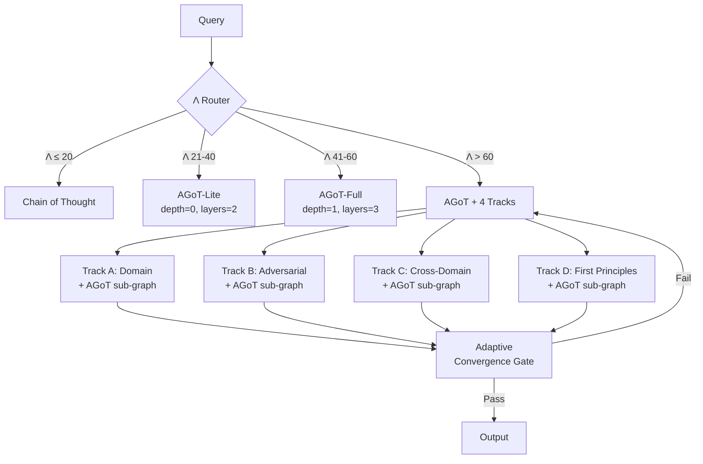

# Protocol 75: Synthetic Parallel Reasoning (v5.0 — AGoT)

> **Purpose**: Adaptive Graph of Thoughts reasoning with dynamic topology and recursive decomposition.
> **Status**: ACTIVE (March 2026)
> **Version**: 5.0 (AGoT-Enhanced)
> **Scope**: `/ultrastart` sessions only
> **Tags**: `#reasoning` `#architecture` `#parallel` `#protocol` `#agot` `#deep-think`
> **Paper**: Pandey et al. (2025), arXiv:2502.05078

---

## 1. What Changed from v4.0

| Dimension | v4.0 (Static) | v5.0 (AGoT) |
|:----------|:--------------|:-------------|
| **Topology** | Fixed 4 tracks | Dynamic DAG with recursive nesting |
| **Node creation** | 4 hardcoded tracks | LLM-driven decomposition (1-5 nodes/layer) |
| **Depth** | Flat (1 layer) | Recursive (up to `max_depth` levels) |
| **Pruning** | None (all tracks run) | Confidence-based branch termination |
| **Convergence** | Fixed ≥ 85/100 | Adaptive threshold by inter-track agreement |
| **Track personas** | Always all 4 | Dynamically instantiated per subproblem |
| **Script** | `parallel_orchestrator.py` | `agot_orchestrator.py` |

> [!IMPORTANT]
> v4.0 (`parallel_orchestrator.py`) remains available as a fallback. v5.0 does NOT
> delete or modify it. The two coexist — v5.0 is activated only in `/ultrastart` context.

---

## 2. Core Architecture



---

## 3. AGoT Algorithm (Layer-by-Layer)

```
AGoT_Solve(query, depth=0):
  1. STRATEGY: LLM generates decomposition strategy for this layer
  2. DECOMPOSE: LLM splits query into N subproblems (≤ max_new_tasks)
  3. RESOLVE (concurrent):
     For each subproblem node:
       a. LLM resolves the subproblem
       b. LLM assesses complexity of result
       c. IF complex AND depth < max_depth → RECURSE: AGoT_Solve(subproblem, depth+1)
       d. IF simple → lock result
  4. SYNTHESIZE: LLM aggregates all resolved nodes into final answer
  5. TERMINATE: If confidence ≥ threshold OR max_layers reached → return
```

**Execution pattern**: BFS across layers × DFS into recursive sub-graphs.

---

## 4. Configuration Tiers

| Λ Range | Mode | max_depth | max_layers | max_new_tasks | Expected LLM Calls |
|:--------|:-----|:----------|:-----------|:--------------|:--------------------|
| ≤ 20 | CoT | — | — | — | 1 |
| 21-40 | AGoT-Lite | 0 | 2 | 3 | 6-12 |
| 41-60 | AGoT-Full | 1 | 3 | 4 | 15-25 |
| > 60 | AGoT + Tracks | 2 | 4 | 5 | 50-120 (across 4 tracks) |

---

## 5. Track Personas (Unchanged from v4.0)

The 4 tracks survive as **node personas** — epistemologically distinct lenses:

| Track | Role | When Instantiated |
|:------|:-----|:------------------|
| **A: Domain Expert** | Apply domain-specific frameworks | Always (Λ > 60) |
| **B: Adversarial Skeptic** | Challenge premises, find flaws | Always (Λ > 60) |
| **C: Cross-Domain** | Find isomorphic patterns | Always (Λ > 60) |
| **D: Zero-Point** | First principles inversion | Always (Λ > 60) |

Each track runs its own **internal AGoT sub-graph**. Sub-graph depth is capped at
`max_depth - 1` to prevent exponential blowup.

---

## 6. Adaptive Convergence Gate (New in v5.0)

Replaces fixed ≥ 85/100 threshold with **agreement-adaptive scoring**:

| Inter-Track Agreement | Threshold | Rationale |
|:---------------------|:----------|:----------|
| High (> 0.8) | 70/100 | Tracks agree — lower bar acceptable |
| Partial (0.5-0.8) | 85/100 | Standard rigor |
| Low (< 0.5) | 90/100 | Disagreement demands stronger evidence |

When agreement is low, an additional **reconciliation round** is triggered
where the synthesis explicitly addresses each point of divergence.

---

## 7. Convergence & Termination

**Pruning**: Nodes scoring below `confidence_threshold` (default 0.35) are terminated.

**Self-termination triggers**:

1. All leaf nodes resolved with confidence ≥ threshold
2. Maximum graph depth (`max_depth`) reached
3. Successive layers show diminishing improvement (Δ < 0.05)
4. Total LLM call budget exhausted

**Safety mechanisms**:

- Hard limits: `max_depth`, `max_layers`, `max_new_tasks`
- DAG enforcement: no cycles (heritage tracking prevents revisiting ancestors)
- Total call cap: configurable maximum LLM calls per run

---

## 8. Execution

```bash
# AGoT-Lite (single-tier, no tracks)
python3 scripts/core/reasoning/agot_orchestrator.py "Your query" --mode lite

# AGoT-Full (with 4-track integration)
python3 scripts/core/reasoning/agot_orchestrator.py "Your query" --mode full

# With output persistence
python3 scripts/core/reasoning/agot_orchestrator.py "Your query" --output output/result.md --json
```

---

## 9. References

- [Protocol 75 v4.0](examples/protocols/decision/75-synthetic-parallel-reasoning.md) — Static predecessor
- [Protocol 137](examples/protocols/decision/137-graph-of-thoughts.md) — Static GoT topology
- [AGoT Paper](https://arxiv.org/abs/2502.05078) — Pandey et al. (2025)
- [RouteGoT Paper](https://arxiv.org/abs/2603.05818) — Liu et al. (2026)
- [GoT Paper](https://arxiv.org/abs/2308.09687) — Besta et al. (2024, AAAI)

---

## Tagging

# protocol #framework #75-synthetic-parallel-reasoning #agot #v5
